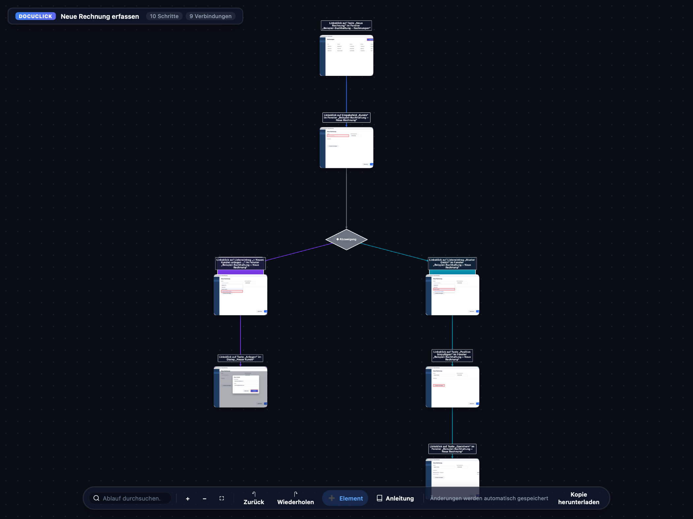
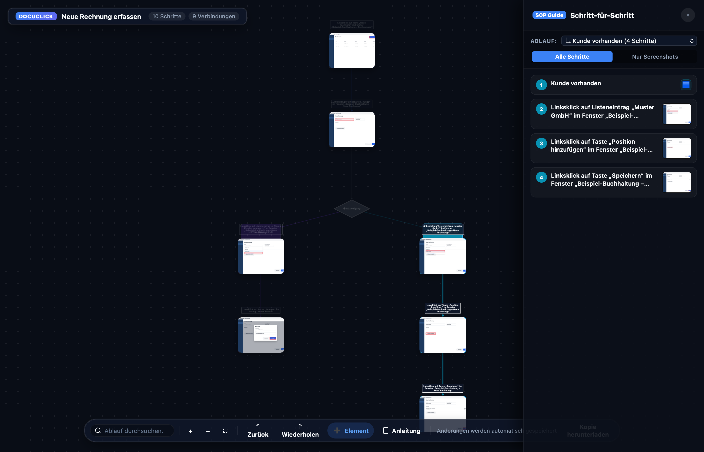
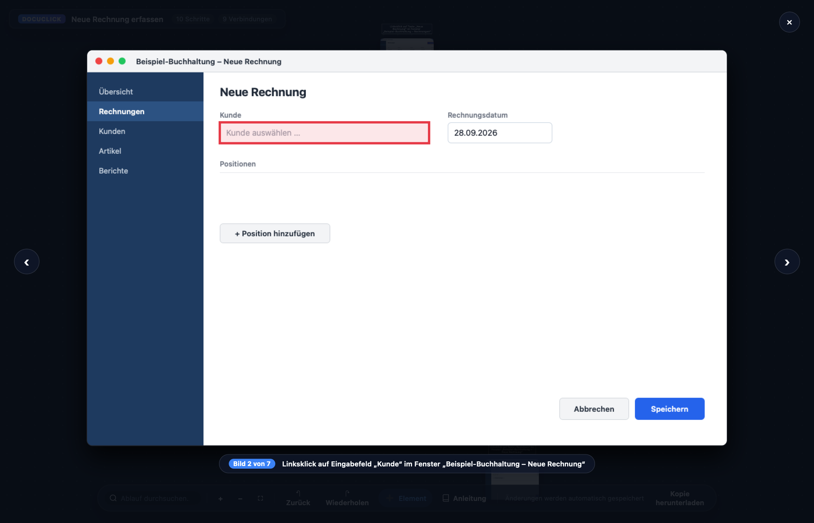
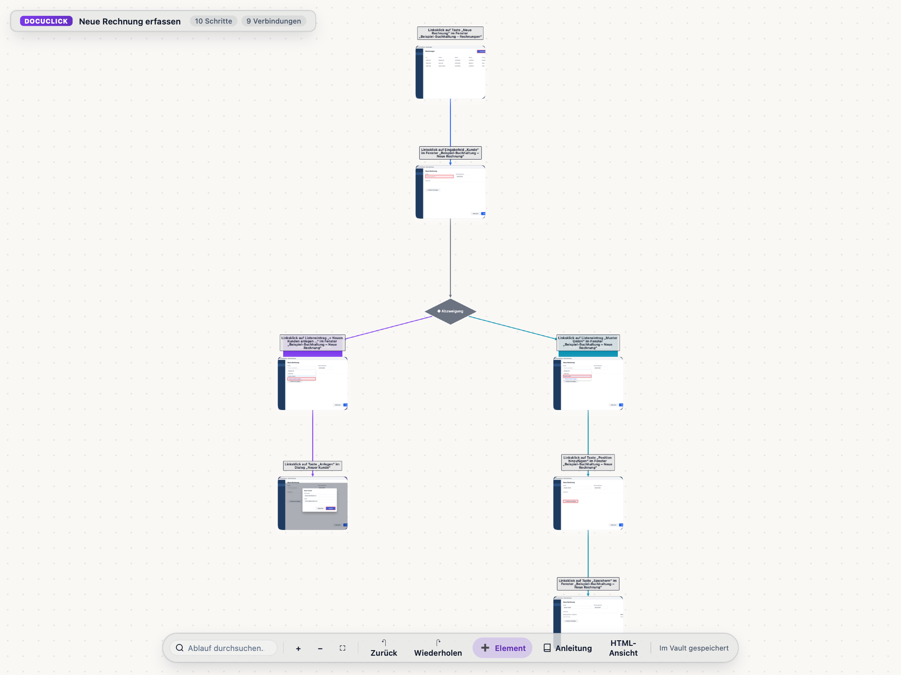

# DocuClick

Klick-Dokumentation per Screenshot: Jeder Mausklick erzeugt einen Screenshot
mit Markierung und einen Schritt in einem interaktiven **Ablauf**, einer
eigenständigen `.html`-Datei, die sich in jedem Browser öffnen und bearbeiten
lässt.


*Beispiel-Ablauf mit einer erfundenen Beispiel-App.*

| Schritt-für-Schritt-Anleitung | Screenshot in voller Größe | Obsidian-Plugin mit eigenem Farbschema |
|---|---|---|
|  |  |  |

Das Repository enthält drei eigenständige Teile mit jeweils eigener Version,
eigenem Changelog, eigener CI und eigenen Releases:

| Bereich | Ordner | Release-Tags | Changelog |
|---|---|---|---|
| **DocuClick für Windows** (WPF) | [windows/](windows/README.md) | `v*` (z. B. `v1.14.0`) | [windows/CHANGELOG.md](windows/CHANGELOG.md) |
| **DocuClick für macOS** (Avalonia + Swift) | [macos/](macos/README.md) | `macos-v*` | [macos/CHANGELOG.md](macos/CHANGELOG.md) |
| **DocuClick Diagrams für Obsidian** (Plugin, ohne Screenshot-Aufnahme) | [obsidian/](obsidian/README.md) | `obsidian-v*` | [obsidian/CHANGELOG.md](obsidian/CHANGELOG.md) |

Gemeinsam genutzt:

- [core/](core/README.md): plattformunabhängiger Kern beider Apps
  (Speicherformat, Ablauf-Editor, Session-Logik) mit Tests. Das Plugin
  bündelt daraus die HTML-Vorlage, damit alle drei dasselbe Format sprechen.
- [OutputTemplate/](OutputTemplate/README.md): leere Ordnerstruktur für einen
  Dokumentations-Vault.

Downloads: [Releases](https://github.com/Woschj/DocuClick/releases).

## Installation

Alle Downloads auf der [Release-Seite](https://github.com/Woschj/DocuClick/releases);
jeder Teil hat eigene Releases (am Tag erkennbar).

**Windows** (Release `v…`): `DocuClick-win-x64.zip` entpacken und
`DocuClick.exe` starten. Kein .NET nötig. Bei der SmartScreen-Warnung
„Weitere Informationen → Trotzdem ausführen“. DocuClick läuft danach als
Tray-Icon. → [Anleitung](windows/README.md)

**macOS** (Apple Silicon, ab macOS 14):
`DocuClick-macos-arm64.zip` entpacken, `DocuClick.app` nach **Programme**
ziehen, öffnen und einmalig unter **Systemeinstellungen → Datenschutz &
Sicherheit → „Trotzdem öffnen“** freigeben. Danach Bedienungshilfen,
Eingabeüberwachung und Bildschirmaufnahme erlauben. DocuClick läuft als
Symbol in der Menüleiste. → [Anleitung](macos/README.md)

**Obsidian** (Desktop): `docuclick-diagrams.zip`
entpacken, den Ordner `docuclick-diagrams` nach
`<Vault>/.obsidian/plugins/` kopieren, Obsidian neu laden und unter
**Einstellungen → Community-Plugins** „DocuClick Diagrams“ aktivieren.
→ [Anleitung](obsidian/README.md)

## Nutzung in Kürze

1. **Aufnehmen** (Windows/macOS): Aufnahme starten (Top-Leiste, Tray-/
   Menüleisten-Symbol oder Tastenkürzel), Speicherort wählen und ganz normal
   klicken. Jeder Klick wird ein Schritt mit Screenshot.
2. **Nachbearbeiten**: in der Ablauf-Übersicht der App oder direkt im
   Browser. Solange DocuClick läuft, speichert der Browser Änderungen direkt
   in die `.html`-Datei.
3. **Weitergeben**: Die `.html`-Datei ist eigenständig (Screenshots
   eingebettet) und öffnet sich in jedem Browser. Optional als draw.io-
   Diagramm exportieren.
4. **Mit Obsidian** (empfohlen für eine Wissenssammlung): Das Plugin ist die
   Basis, die Apps nehmen dafür auf. Liegt der Speicherort in einem Vault,
   ist jeder Ablauf eine einzige Notiz: im Plugin ein Diagramm-Tab, für
   Obsidian eine durchsuchbare Notiz mit Schrittliste. Sie lässt sich schon
   während der Aufnahme öffnen und bearbeiten; Screenshots liegen als
   Dateien im Vault. Ohne App: Abläufe im Vault anlegen oder ältere
   DocuClick-HTML importieren. Weitergeben als HTML-Ansicht.
   → [Direkt in den Vault aufnehmen](obsidian/README.md#mit-docuclick-für-windowsmacos-direkt-in-den-vault-aufnehmen)

## Entwicklung

```bash
dotnet test --project core/DocuClick.Core.Tests          # gemeinsamer Kern
dotnet build windows/DocuClick.Windows.sln               # Windows-App
dotnet build macos/DocuClick.Mac.slnx                    # macOS-App (nur auf dem Mac)
python3 obsidian/build.py                                # Obsidian-Plugin
```

Releases: Windows-App, macOS-App und Obsidian-Plugin erscheinen zusammen in
einem Release mit derselben Version. `python3 tools/release.py 1.18.0` setzt
die Version aller drei Teile und datiert ihre Changelogs; nach dem Merge auf
`main` das Tag anlegen und pushen:

```bash
git tag -a v1.18.0 -m v1.18.0
git push origin v1.18.0
```

Das Tag startet [release.yml](.github/workflows/release.yml): Es prüft, dass
die Versionen zum Tag passen, baut und testet alle drei Teile und
veröffentlicht ein Release mit genau drei Downloads (Windows-App, macOS-App,
Obsidian-Plugin) und den Changelog-Abschnitten als Beschreibung.

Aufräumen: Der Workflow [Releases aufräumen](.github/workflows/cleanup-releases.yml)
(Actions → „Releases aufräumen“ → „Run workflow“, zur Bestätigung `LÖSCHEN`
eingeben) löscht alle Releases und Tags außer dem angegebenen und entfernt
aus diesem alle Dateien außer den drei Downloads. Nicht rückgängig zu machen.

Messung langer Aufnahmen: `DOCUCLICK_BENCH=ergebnis.txt dotnet test --project
core/DocuClick.Core.Tests -- --filter-class "*RecordingBenchmark"` (100 Klicks
mit echten Screenshots, Zeit pro Klick, geschriebene Daten).

Die CI-Workflows in [.github/workflows/](.github/workflows/) sind nach
Bereich getrennt (`windows.yml`, `macos.yml`, `obsidian.yml`). Bei Pull
Requests läuft jeder nur, wenn sein Bereich oder der gemeinsame Kern
betroffen ist.
